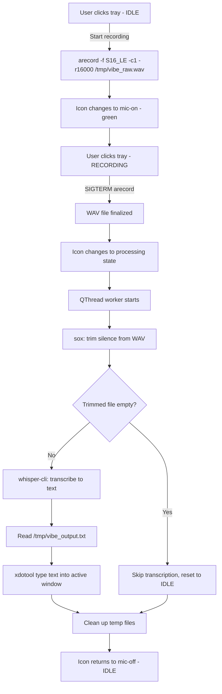
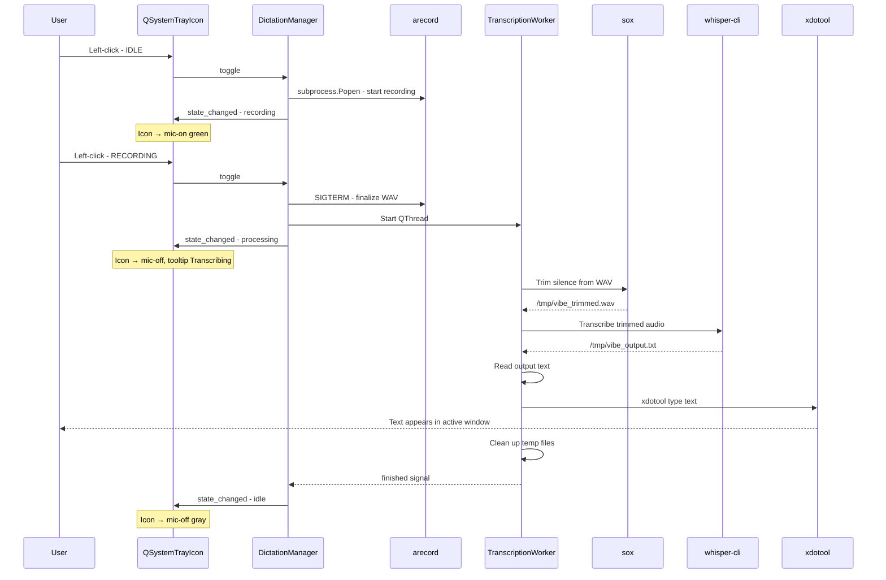

# Whisper Dictation — System Tray App Architecture

**Created:** 2026-04-01
**Updated:** 2026-04-01 — Refactored from real-time streaming (whisper-stream) to batch record-then-transcribe workflow (arecord → sox → whisper-cli → xdotool).

## Overview

A minimal KDE Plasma system tray application that provides push-to-talk voice dictation. The user clicks the tray icon to start recording, clicks again to stop. The recorded audio is trimmed, transcribed offline via `whisper-cli`, and the resulting text is injected into the focused X11 window via `xdotool`.

The tray icon cycles through three states: **IDLE**, **RECORDING**, and **PROCESSING**.

## Architecture Diagram

```mermaid
stateDiagram-v2
    [*] --> IDLE
    IDLE --> RECORDING : Click tray icon
    RECORDING --> PROCESSING : Click tray icon
    PROCESSING --> IDLE : Transcription complete
    PROCESSING --> IDLE : Error or empty result

    state IDLE {
        direction LR
        note right of IDLE : mic-off icon, gray
    }
    state RECORDING {
        direction LR
        note right of RECORDING : mic-on icon, green\narecord running
    }
    state PROCESSING {
        direction LR
        note right of PROCESSING : mic-off icon\nQThread worker active
    }
```

## Pipeline



## Pipeline Steps Detail

1. **Click 1 (IDLE → RECORDING):** Start `arecord -f S16_LE -c1 -r16000 /tmp/vibe_raw.wav` as a background subprocess. Store its PID. Tray icon changes to mic-on (green).
2. **Click 2 (RECORDING → PROCESSING):** Kill the `arecord` process (SIGTERM) to finalize the WAV file. Tray icon changes to a processing state. Then run the following pipeline in a background thread (QThread worker) to keep the UI responsive:
   - **a. Silence trim:** `sox /tmp/vibe_raw.wav /tmp/vibe_trimmed.wav silence 1 0.1 1% -1 0.1 1%`
   - **b. Transcribe:** `~/.local/share/dictation-tool/whisper.cpp/build/bin/whisper-cli -m ~/.local/share/dictation-tool/whisper.cpp/models/ggml-large-v3-turbo-q5_0.bin -f /tmp/vibe_trimmed.wav -nt -et 2.4 -l en --prompt "Roo Code, Python, TypeScript, React, useEffect, camelCase, JSON, frontend, backend, sudo, bash, IDE" -of /tmp/vibe_output -otxt`
   - **c. Read output:** Read `/tmp/vibe_output.txt`
   - **d. Inject text:** `xdotool type --clearmodifiers --delay 2 "<text>"`
3. **Processing complete → IDLE:** Tray icon returns to mic-off (gray). Clean up temp files.

## File Structure

```
whisper_dictation/
├── main.py              # Entry point — tray icon and app lifecycle
├── dictation.py         # DictationManager — record/trim/transcribe/inject pipeline
├── config.py            # Paths and constants
├── setup_whisper.sh     # Clone, compile whisper.cpp with Vulkan, download model
├── install.sh           # Installer — autostart and app launcher entries
├── icons/
│   ├── mic-on.svg       # Tray icon: recording active - green
│   └── mic-off.svg      # Tray icon: idle - gray
├── requirements.txt
├── plans/
│   └── architecture.md  # This file
└── README.md
```

**Total: 4 Python files + 2 SVG icons + 2 shell scripts + 2 docs.** Intentionally minimal.

## Component Design

### 1. `config.py` — Constants

Holds all paths and command arguments in one place:

| Constant | Value |
|---|---|
| `WHISPER_BASE` | `~/.local/share/dictation-tool/whisper.cpp` |
| `WHISPER_CLI_BIN` | `WHISPER_BASE/build/bin/whisper-cli` |
| `WHISPER_MODEL` | `WHISPER_BASE/models/ggml-large-v3-turbo-q5_0.bin` |
| `RAW_WAV` | `/tmp/vibe_raw.wav` |
| `TRIMMED_WAV` | `/tmp/vibe_trimmed.wav` |
| `OUTPUT_TXT` | `/tmp/vibe_output.txt` |
| `ARECORD_CMD` | `["arecord", "-f", "S16_LE", "-c1", "-r16000", RAW_WAV]` |
| `SOX_CMD` | `["sox", RAW_WAV, TRIMMED_WAV, "silence", "1", "0.1", "1%", "-1", "0.1", "1%"]` |
| `WHISPER_ARGS` | `["-m", WHISPER_MODEL, "-f", TRIMMED_WAV, "-nt", "-et", "2.4", "-l", "en", "--prompt", "...", "-of", "/tmp/vibe_output", "-otxt"]` |
| `ICON_MIC_ON` | `icons/mic-on.svg` |
| `ICON_MIC_OFF` | `icons/mic-off.svg` |

### 2. `main.py` — Entry Point and Tray Icon

Responsibilities:
- Create `QApplication` with `QSystemTrayIcon`
- Set initial icon to mic-off
- Connect left-click signal to `DictationManager.toggle()`
- Right-click context menu with: **Toggle Dictation**, **Quit**
- Update icon and tooltip based on three states
- Run dependency checks at startup

State-to-UI mapping:

| State | Icon | Tooltip |
|---|---|---|
| IDLE | mic-off (gray) | Whisper Dictation — Ready |
| RECORDING | mic-on (green) | Whisper Dictation — Recording... |
| PROCESSING | mic-off (gray) | Whisper Dictation — Transcribing... |

Key details:
- Uses `QSystemTrayIcon.activated` signal — check for `QSystemTrayIcon.Trigger` to detect left-click
- `QSystemTrayIcon` on KDE Plasma automatically registers via `StatusNotifierItem` D-Bus protocol — no extra work needed
- Owns a `DictationManager` instance
- Dependency checks at startup: verify `arecord`, `sox`, `whisper-cli`, `xdotool` exist on PATH or at configured paths

### 3. `dictation.py` — DictationManager and TranscriptionWorker

#### DictationManager(QObject)

Three states: `IDLE`, `RECORDING`, `PROCESSING`

Methods:
- `toggle()` — State router: IDLE → start recording, RECORDING → stop and process, PROCESSING → ignore
- `_start_recording()` — Launch `arecord` via `subprocess.Popen`, store the process reference
- `_stop_and_process()` — Kill arecord with SIGTERM to finalize WAV, start `TranscriptionWorker` QThread

Signals:
- `state_changed(str)` — emits `"idle"`, `"recording"`, or `"processing"`
- `error_occurred(str)` — emits error description for tray notifications

#### TranscriptionWorker(QThread)

Runs the entire post-recording pipeline in a background thread to keep the UI responsive:


Steps:
1. Run `sox` to trim leading/trailing silence from the raw WAV
2. Check if trimmed file exists and is non-empty; if empty, skip to cleanup
3. Run `whisper-cli` with configured arguments to transcribe
4. Read the output text file (`/tmp/vibe_output.txt`)
5. Strip whitespace; if non-empty, run `xdotool type --clearmodifiers --delay 2` to inject text
6. Clean up temp files (`RAW_WAV`, `TRIMMED_WAV`, `OUTPUT_TXT`)
7. Emit completion signal so `DictationManager` transitions back to IDLE

### 4. Icons

SVG icons for crisp rendering at any size:
- **mic-on.svg**: Green microphone — recording is active
- **mic-off.svg**: Gray microphone — idle / processing

## Data Flow



## Error Handling

| Scenario | Handling |
|---|---|
| `whisper-cli` binary not found | Show tray notification at startup |
| `arecord` not found | Show tray notification at startup |
| `sox` not found | Show tray notification at startup |
| `xdotool` not found | Show tray notification at startup |
| `arecord` fails during recording | Detect via returncode, reset to IDLE, show notification |
| `whisper-cli` fails | Detect in worker thread, emit error signal, reset to IDLE |
| Empty recording - all silence trimmed | Check if trimmed file is empty/missing, skip transcription, reset to IDLE |
| User clicks during PROCESSING | Ignore the click - already processing |

## Dependencies

- **PyQt5** — `QApplication`, `QSystemTrayIcon`, `QThread`, `QMenu`, `QIcon`
- **arecord** — ALSA utility for audio recording (from `alsa-utils` package)
- **sox** — Sound processing tool for silence trimming
- **xdotool** — System package for X11 text injection
- **whisper-cli** — Pre-compiled binary from whisper.cpp (built via `setup_whisper.sh`)

`requirements.txt`:
```
PyQt5>=5.15
```

## Implementation Plan

1. Update `config.py` with new constants (paths, commands, temp files)
2. Rewrite `dictation.py` with `DictationManager` (3-state machine) and `TranscriptionWorker` (QThread)
3. Update `main.py` to handle 3 states for icon/tooltip and add dependency checks
4. Create `setup_whisper.sh` for whisper.cpp compilation with Vulkan and model download
5. Update `install.sh` if needed
6. Update `README.md` with new usage instructions
7. Test end-to-end: click to record, click to stop, verify text appears in a text editor
